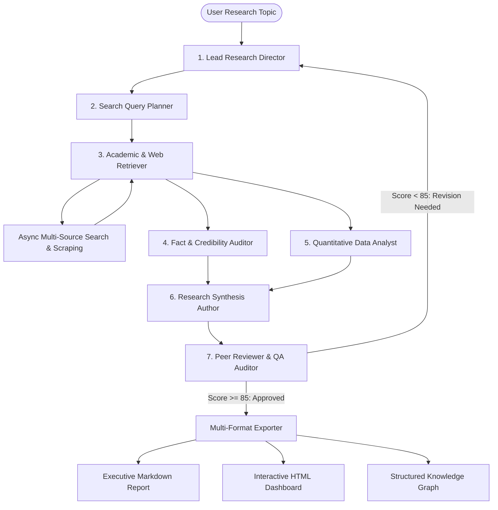

<div align="center">

# 🔬 ResearchCore AI: Multi-Agent Deep Research System
### *Autonomous Multi-Agent Intelligence Engine for Deep Academic, Technical, and Market Research*

[](https://github.com/meAMANgit/Multi-Agent-AI-Research-System/actions)
[](https://www.python.org/)
[](https://fastapi.tiangolo.com)
[](https://streamlit.io)
[](https://docs.pydantic.dev/)
[](https://opensource.org/licenses/MIT)

---

</div>

## 📌 Executive Summary

**ResearchCore AI** is an enterprise-grade autonomous research platform powered by a collaborative team of **7 specialized AI agents**. It transforms high-level technical or strategic research inquiries into comprehensive, verified, peer-reviewed executive whitepapers with empirical benchmarks, quantitative models, and IEEE citations.

Unlike basic search wrappers, ResearchCore AI utilizes an **iterative graph state machine** with automated fact-checking, domain authority ranking, and a **5-dimension Peer Review QA audit** that automatically initiates targeted revision loops when reports do not meet rigorous quality thresholds.

---

## 🏗️ Multi-Agent Architecture



---

## 🤖 The 7 Specialized Research Agents

| Agent | Persona | Primary Responsibility |
| :--- | :--- | :--- |
| **🎯 1. Director** | `DirectorAgent` | Formulates core hypotheses, defines 5 research dimensions, manages revision loops. |
| **🧭 2. Query Planner** | `QueryPlannerAgent` | Expands research vectors across academic, market, benchmark, and risk angles. |
| **🌐 3. Retriever** | `RetrieverAgent` | Concurrently queries search engines (DuckDuckGo, Wikipedia, arXiv, Tavily) and scrapes clean markdown. |
| **🔍 4. Fact Checker** | `FactCheckerAgent` | Audits evidence, calculates confidence scores (0-100), eliminates hallucinations. |
| **📊 5. Data Analyst** | `DataAnalystAgent` | Extracts numerical benchmarks, CAGR growth rates, latency metrics, and compiles trade-off tables. |
| **✍️ 6. Report Writer** | `ReportWriterAgent` | Synthesizes verified findings into an executive-grade whitepaper with IEEE citations. |
| **⚖️ 7. Peer Reviewer** | `PeerReviewerAgent` | Evaluates report against a 5-dimension rubric (Depth, Accuracy, Flow, Citations, Objectivity). |

---

## ✨ Key Capabilities

- **Multi-Provider LLM Engine**: Seamlessly switch between **Google Gemini**, **OpenAI GPT-4o**, **Anthropic Claude**, **Groq**, **Ollama (local offline)**, or zero-cost **Mock Engine**.
- **Multi-Source Retrieval & Parsing**: DuckDuckGo, Wikipedia API, arXiv academic repository, Tavily API, and async web crawling with clean HTML-to-markdown conversion.
- **Evidence & Citation Ledger**: Automated domain authority scoring (`.edu`, `.gov`, `arxiv.org`, `nature.com`) and IEEE numbered citations.
- **5-Dimension Peer-Review QA**: Evaluates reports on an enterprise rubric (0-100). Auto-triggers targeted revision loops if score < 85%.
- **Multiple Production Interfaces**:
  - 🖥️ **Streamlit Web Dashboard**: Real-time agent thought streaming, interactive metric tiles, and dossier explorer.
  - ⚡ **FastAPI REST & WebSockets**: Background async task execution, live WebSocket thought stream, OpenAPI docs.
  - 💻 **Rich Terminal CLI**: Interactive CLI with colored spinners, tables, and direct file output.
- **Multi-Format Intelligence Package**: Instant export to **Executive Markdown (`.md`)**, **Interactive Standalone HTML (`.html`)**, or **JSON Knowledge Graph (`.json`)**.
- **Enterprise-Ready DevOps**: Dockerfile, Docker Compose, GitHub Actions CI/CD matrix across Python 3.10 through 3.14.

---

## 🚀 Quickstart Guide

### 1. Installation

```bash
# Clone the repository
git clone https://github.com/meAMANgit/Multi-Agent-AI-Research-System.git
cd Multi-Agent-AI-Research-System

# Create and activate virtual environment
python -m venv .venv
source .venv/bin/activate  # On Windows: .venv\Scripts\activate

# Install dependencies
pip install -r requirements.txt
```

### 2. Environment Setup

Copy `.env.example` to `.env` and set your preferred API keys:
```bash
cp .env.example .env
```
*(Note: If no API keys are configured, the system automatically uses the high-quality deterministic Mock Engine at zero cost.)*

---

## 🖥️ Usage Interfaces

### Option A: Interactive Web UI (Streamlit)
```bash
streamlit run src/research_system/ui/streamlit_app.py
```
Open [http://localhost:8501](http://localhost:8501) in your browser.

---

### Option B: FastAPI Backend Server & WebSockets
```bash
python -m uvicorn src.research_system.api.server:app --host 0.0.0.0 --port 8000 --reload
```
- Interactive OpenAPI Docs: [http://localhost:8000/docs](http://localhost:8000/docs)
- WebSocket Stream: `ws://localhost:8000/api/ws/global`

---

### Option C: Terminal CLI
```bash
# Interactive Mode
python cli/main.py --interactive

# Direct Topic Execution with Export
python cli/main.py --topic "Solid State Battery Commercialization" --depth standard --output ./report.html --format html
```

---

## 🐳 Docker Deployment

Run both the FastAPI backend and Streamlit UI in isolated containers:
```bash
docker compose up --build
```
- **Streamlit Web UI**: [http://localhost:8501](http://localhost:8501)
- **FastAPI Server**: [http://localhost:8000/docs](http://localhost:8000/docs)

---

## 🧪 Running Tests

Execute the comprehensive test suite with `pytest`:
```bash
pytest tests/ -v
```

---

## 📁 Repository Structure

```
Multi-Agent-AI-Research-System/
├── .github/workflows/ci.yml       # GitHub Actions CI/CD pipeline
├── src/research_system/
│   ├── config/                    # Settings & system prompts for all 7 agents
│   ├── models/                    # Pydantic v2 schemas, state machine & enums
│   ├── llm/                       # Multi-provider LLM abstraction & cost tracker
│   ├── tools/                     # Web scraper, multi-engine search, data extractor
│   ├── agents/                    # 7 specialist research agents (Director, Writer, QA, etc.)
│   ├── orchestrator/              # Graph execution engine with feedback loops
│   ├── exporters/                 # Markdown, HTML dashboard, and JSON graph exporters
│   ├── api/                       # FastAPI REST API & WebSocket thought stream
│   └── ui/                        # Premium Streamlit web application
├── cli/                           # Rich terminal CLI
├── tests/                         # Unit & end-to-end integration tests
├── docs/                          # Architectural specs, API reference, agent rubrics
├── Dockerfile                     # Multi-stage production container
├── docker-compose.yml             # API & UI multi-container orchestration
├── requirements.txt               # Production dependencies
├── pyproject.toml                 # Package configuration
└── README.md                      # Documentation
```

---

## 📄 License

Distributed under the **MIT License**. See [`LICENSE`](LICENSE) for more information.
